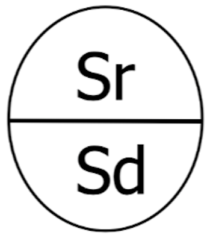

class: title, smokescreen, shelf, no-footer
background-image: url(element5-digital-bXSjhkDgBtM-unsplash.jpg)

# What Do Photographs Do? 
### 'Studium' and 'Punctum' September 4, 2019

---
class: title
# First: some more semiotics

---
class: title
background-image: url(saussure_peirce.png)

---
class: title
background-image: url(saussure_vs_peirce.png)

---
class: img-left compact
# Barthes' Contribution to Semiotics

* **Denotation** 
--
    The _literal_ meaning of a sign

--
* **Connotation** 
--
    Social, cultural, &amp; historical meanings that are "added" to denotation

--
* **Myth** 
--
    The hidden set of rules, codes, &amp; conventions through which meanings, which in reality are specific to certain groups, are _rendered universal and given for a whole society._  They are **naturalized**.

---
class: col-3
# Semiotics Key Terms

* Dyadic Structure of a Sign (Saussure)  
       
* Continuum of “Motivation” (Peirce)  
    * Symbol  
    * Icon  
    * Index     
* Levels of Signification (Barthes)  
    * Denotation  
    * Connotation  
    * Myth

---
class: title 
# So . . . What Do Photographs Do?

---
class: roomy
    

> **<q>A photograph made me pause.</q>**

> <cite>– Roland Barthes, _Camera Lucida_</cite>

---

## Barthes’ Question:  
### _What Is Photography?_

[ An ontological question ]

---

# Difficulty in Seeing Photography
--

> “A specific photograph, in effect, is never distinguished from its referent . . . or at least it is not immediately . . . it is not impossible to perceive the photographic signifier (certain professionals do so), but it requires . . . reflection.” (p. 5)

--

> “Whatever it grants to vision and whatever its manner, a photograph is always invisible.  It is not it that we see.” (p. 6)

---

# Photography is _deictic_

--
* A photograph “points a finger” (p. 6)  

--
* A photograph is _“here, now”_ but it always points to _“what was there, then.”_  

--
* “Look” “See” “Here it is”

---
class: title
# studium punctum

---

# studium

--
* an affective relationship to the photograph characterized by “general and . . . _polite interest_,” the order of “liking”  

--
* focus on the informational character of photography:  what did the photographer (“operator”) intend to convey?  

--
* apprehended “in reverse”, as spectator

---

# punctum

--
* “this element which rises from the scene, shoots out of it like an arrow, and pierces me” (p. 26)  

--
* Latin word: wound, prick, or mark made by a pointed instrument  

--
* “that accident which pricks me” (p. 27)  

--
* NOT the result of analysis:  “In order to perceive the punctum, no analysis would be of any use to me” (p. 42)

---
class: roomy 
   
> **<q> . . . in order to see a photograph well, it is best to look away or close your eyes.</q>**

> <cite>– Roland Barthes<cite>

---
class: title

background-image: url(fleeing_basra.png)

---

## For Friday's discussion sections:

* Class will be held in Rubenstein Library, room 150 on West Campus where Joshua Larkin Rowley will introduce us to the [Hartman Center for Sales, Advertising &amp; Marketing History](https://library.duke.edu/rubenstein/hartman)!  
* Bring your camera-capable mobile device (phone, tablet, old school camera)  
* Please arrive early (or at least not late!)!!