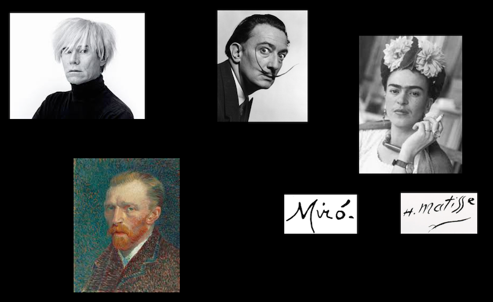

class: title, smokescreen, shelf, no-footer
background-image: url(aaron-burden-y02jEX_B0O0-unsplash.jpg)

# The Politics of Authorship
### Part 1: Barthes v. Foucault September 16, 2019

---
class: compact 
## Paper Advice

1. Include your own name at the start of your paper, along with a title and date.

    > Mark Olson 
    > Paper #1: Semiotic Analysis of a Virginia Slims Ad 
    > September 20, 2019

1. Include your image!

1. Number your pages!

1. Name your Word document in this way:  `lastName_firstName_paper1.docx`

1. When defining key terms, use *both* direct quotation from the textbook (with proper citation) **and** explication in your own words.

1. Email your Word document to both your professor and TA no later than the beginning of your discussion section on Friday.

---

## Review:  Hall's Three "Decoding Positions"

1. **Dominant / Hegemonic**:  The "Preferred Reading" or interpretation.

2. **Negotiated**:  A Negotiated Reading   
    Accepting some of preferred reading, rejecting or ignoring other parts

3. **Oppositional / Counter-Hegemonic**:   
    A “Globally Contrary” or Oppositional Reading

---
class: center
 <small>“The author is a modern figure, a product of our society insofar as . . . it discovered the prestige of the individual.” [Barthes, "The Death of the Author." (142)]</small>
---
class: img-caption

**"The Death of the Author"** Roland Barthes, 1967

---
class: img-right-full

      
**"What is an Author?"** 
Michel Foucault, 1967

---

class: roomy 
# Discuss:

* Main point(s)  
* What is at stake?  
* Examples in support of Barthes? of Foucault?

---
class: roomy
>“To give a text an Author is to impose a limit on that text, to furnish it with a final signified, to close the writing. Such a conception suits criticism very well, the latter then allotting itself the important task of discovering the Author (or its hypostases: society, history, psyche, liberty) beneath the work: when the Author has been found, the text is 'explained' &ndash; victory to the critic.”

><cite>&mdash; Barthes, "The Death of the Author." (147)</cite>

---
class: img-right-full

    
<q>every text is eternally written here and now.</q>

<q>the true place of the writing . . . is reading</q>

<q>...a text's unity lies not in its origin but in its destination.</q>

---
class: title
### What kinds of discourse do we attribute to an Author?

---
class: title
background-image: url(foucault_wordcloud.jpg)

---

### Foucault's Response to / Critique of Barthes
>“It is not enough . . . to repeat the empty affirmation that the author has disappeared. . .   Instead, we must locate the space left empty by the author's disappearance, follow the distribution of gaps and breaches, and watch for the openings its disappearance uncovers.”
> &mdash; <cite>Foucault, "What Is An Author?" (209)</cite>

---
class: title

## Foucault:  _Author Function_

---

# Author Function: _Four Characteristics_

1. Linked to the **juridical** and **institutional** system that encompasses, determines, and articulates the universe of discourses.  
1. Does not affect all discourses in the same way at all times and in all types of civilizations  
1. Defined by _specific and complex operations_.  
1. It does not refer simply to a real individual, since it can give rise simultaneously to different selves, to several subjects – _positions_ that can be occupied by different classes of individuals.

---

