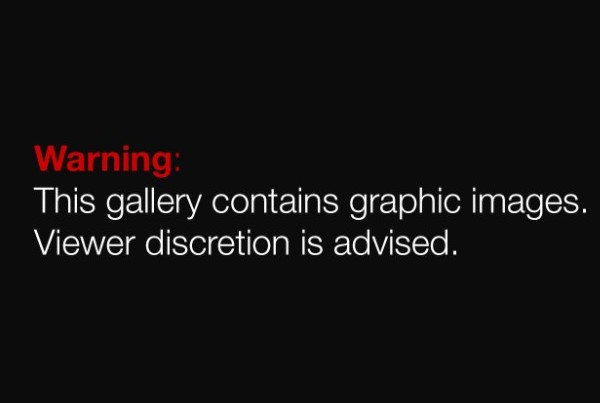
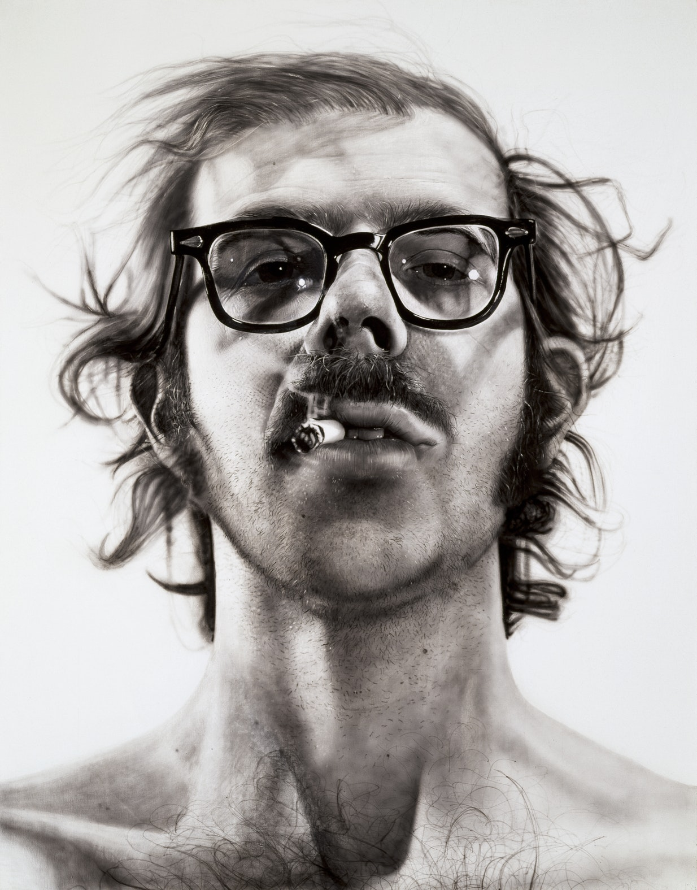
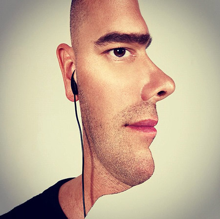
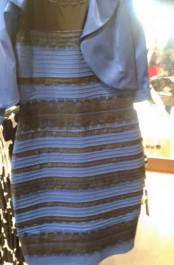
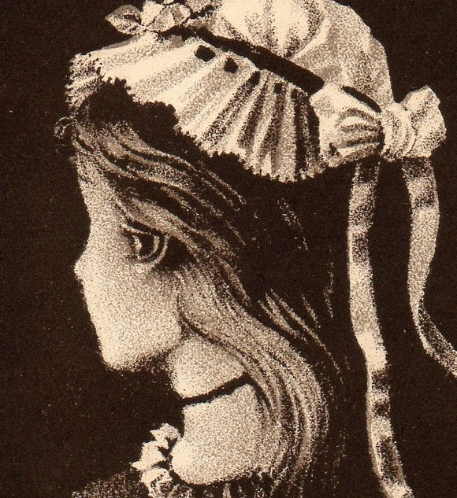
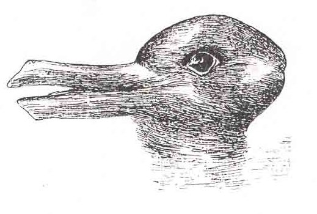
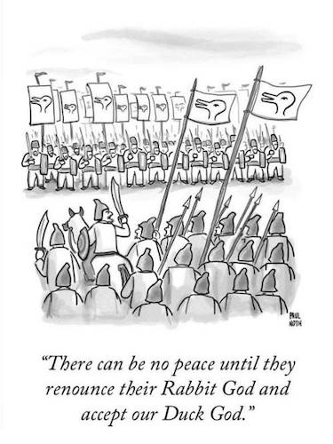

---

class: title, smokescreen, shelf, no-footer

# Images, Power, &amp; Politics
### Part 1 August 31, 2022

---
class: compact
# The Politics of Representation

<iframe width="80%" height="80%" src="https://www.youtube-nocookie.com/embed/MMuUFjxLQJU" frameborder="0" allow="accelerometer; autoplay; encrypted-media; gyroscope; picture-in-picture" allowfullscreen></iframe>

---
class: col-3, compact

# Intertextuality in *Mood 4 Eva*

* **Intertextuality**: The referencing of one text _(or image)_ within another.   
   
   In popular culture, intertextuality refers to the incorporation of one text within another in a ***reflexive*** fashion.   

* _Intertextual references assume that the viewer *knows* the people, events, and/or cultural products being referenced._

--

* the politics of knowledge (culture as distinction: insider/outsider)

---

> How do you look?

---
class: compact 

# How Do You Look? - Looking as Practice

* How do you appear?  (To others / to yourself)

--

* _Do_ you appear (in/visibility)?

--
* How do you see?

    * Point of view / identity &amp; background (race, class, gender, sexuality, religion, ...) 
    * Quality of the Look (gaze, glance, stare, voyeuristic, looking away)
    * "Through" some medium (screen, lens, etc)
--

* _Do_ you see? Are you unable to see?  What is hidden from your gaze?
--

* Do you have the "right to look"?  (Do you have to claim or assert it?)

--

* Are you compelled to look?  (Through force, authority, desire)

---

class: img-caption

???
Power of graphic images...Emmett till or drowned immigrant child for social change

Graphic images for sensationalism... " We have to warn you, some of these images are disturbing"

Coercion in the classroom...the power to make you look

---
# Visuality

> “Whereas the term vision refers to the physical capacity to see, the concept of visuality refers to the ways that **vision is shaped through social context and interaction** [...] Visuality is a term that calls our attention to how the visual is **caught up in power relations that involve the structure of the visual field** as well as the politics of the image”   
> &mdash; Sturken &amp; Cartwright, p. 22

---
class: col-2

# Practicing Looking: Classroom v. Zoom

Free Writing (5 minutes):   
   
   What are the differences between the in-person classroom experience and zoom?

* What do you see vs. what remains hidden?
* How do you see in each space?  How do you appear to yourself and others?
* Is your "right to look" different in each space?  How?
* Where / how might one assert agency over the visual field in each space? 

---
class: col-2, compact

### Visual culture is concerned with *histories of representation*

* Re-present: literally, to "show again"

* "The use of language, marks and images to depict, symbolize, or portray and make meaning from reality (the world around us)" (Sturken & Cartwright, pp. 18-19)

* Some representations we think of as mimetic (aim to be a "mirror copy" of the real/material world). 

* But all representation is **mediated** in some way, refracting that mirror image.

???
Throughout history, debates about representation have considered whether representations reflect the world as it is, mirroring it back to us through imitation or mimesis, or whether we construct the world and its meaning through representations that are abstract and not mimetic or imitative of physical form. (S&C 19)

---
class: img-left

### Mimesis

Chuck Close   
*Big Self Portrait* (1967-68)

---
class: col-2

## Construction

* Mirrors don't reflect back faithfully; they distort  
* The irreducible "gap" between the representation and the thing represented (the "thing itself") *matters*  

*The Treachery of Images* Rene Magritte (1928-29)
---
class: center
## Indeterminacy

---
class: img-right

# What color is this dress?

* Blue?
* Gold?
* White?

---
class: img-left

## Polysemy

---
class: col-2 compact
# Polysemy and Power

--

---

## "Seeing That" vs "Seeing As"
Wittgenstein 

---
class: center

### Kanizsa Triangle

---
class: center

---
class: compact 

**For Friday Discussion Sections:**
* Review lecture notes and Chapter 1, pp 1 - 29.
* Watch:
    * [Stefano Harney on Study](https://www.youtube.com/watch?v=uJzMi68Cfw0)
    * [Fred Moten on Figuring It Out](https://www.youtube.com/watch?v=SmnFeGaCkGI)
    * [Ulay Interview: How I Stole a Painting](https://www.youtube.com/watch?v=i2E0J6J3KGI)
    * [Photographing Secret Sites and Satellites | Meet Trevor Paglen](https://youtu.be/9Igfu0VwdkQ)   
       

 
**For Monday:**

CLASS WILL BE HELD IN 103 CLASSROOM BLDG on East Campus

Read:
*  _Practices of Looking_, Chapter 1 (pp. 29 - 49) 