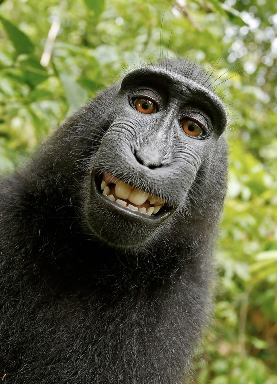
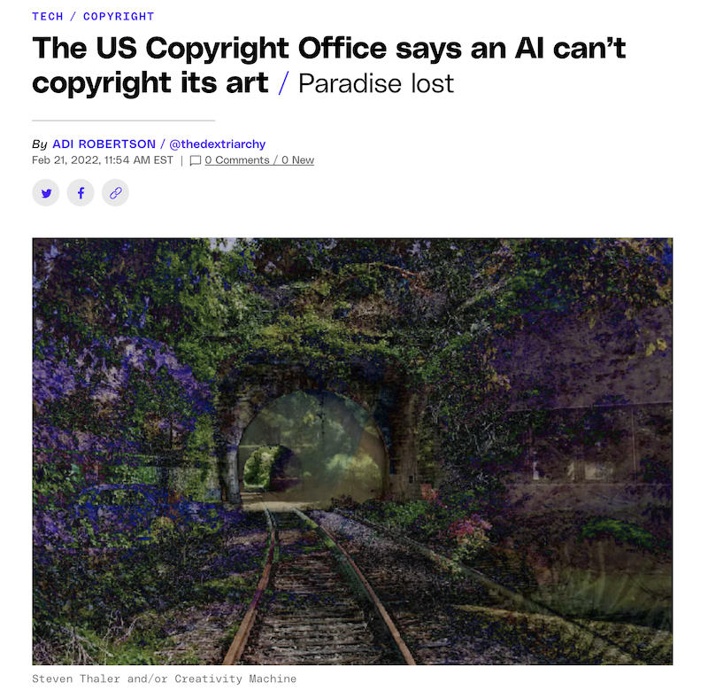
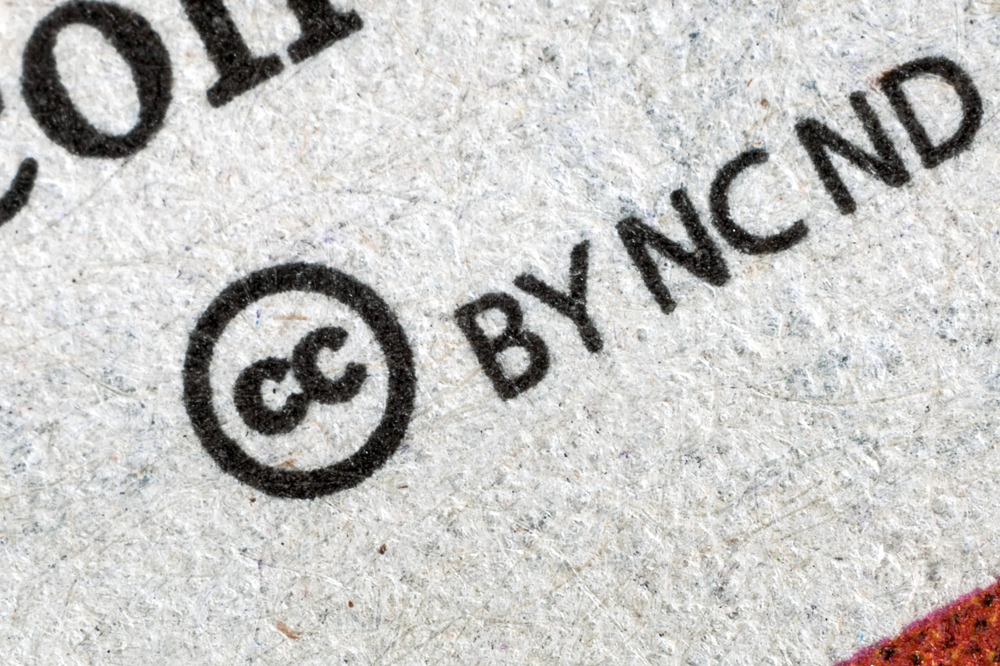

class: title, smokescreen, no-footer
background-image: url(umberto-lhJrm1BRVV0-unsplash.jpg)

--
# Visual Technologies, Reproduction, and the Copy: Part 2 October 26, 2022

---
class: title

# **&copy; copyright All Rights Reserved**

???
Copyright is a legal right created by the law of a country that grants the creator of an original work exclusive rights for its use and distribution.

Variant of property law….intellectual property

---
class: compact
# Copyright(s)

* To **reproduce** the work as copies;

--

* To prepare **derivative** works based upon the work;

--

* To **distribute** copies of the work to the public by sale or other transfer of ownership, or by rental, lease, or lending;

--

* To publicly **perform** the work;

--

* To publicly **display** the work;

--

* To **digitally transmit** (sound recordings only).

---
class: center

  
# Trademark >> Brands  Patent >> Inventions  Copyright >> Artistic Works

???
Intellectual Property

---
# Copyright

* Pursuant to 17 U.S. Code § 102, U.S. copyright applies only to:  
<q>original works of authorship fixed in any tangible medium of expression</q>  

**What about ideas?  Can you copyright an idea?**
--

* 17 U.S.C. § 102(b) codifies that copyright protection does NOT extend to <q>any idea, procedure, process, system, method of operation, concept, principle, or discovery, regardless of the form in which it is described, explained, illustrated, or embodied in such work.</q>

???
Facts and ideas may not be copyrighted. "Useful articles" may not be copyrighted. Useful articles includes typeface designs, fashion designs, blank forms, titles, names, short phrases, slogans, lists of ingredients and contents, domain names and band names.

---

# History of Copyright

* Originated as a means of censorship and control (e.g Stationers Company Monopolies)  
* 1710: British <q>Statute of Anne</q> (14 yrs term, renewable +14, only 5% registered)  
* Written into the US Constitution  
* Made automatic in 1886  
* History of extending the term 

???
The origin of copyright law in most European countries lies in efforts by the church and governments to regulate and control the output of printers after the invention of the printing press. Printing allowed for multiple exact copies of a work, leading to a more rapid and widespread circulation of ideas and information. Pope Alexander VI issued a bull in 1501 against the unlicensed printing of books and in 1559 the Index Expurgatorius, or List of Prohibited Books, was issued for the first time.

In 1557 the English Crown thought to stem the flow of seditious and heretical books by chartering the Stationers' Company. The right to print was limited to the members of that guild: restricted to two universities and to the 21 existing printers in the city of London, which had 53 printing presses. 

The British Statute of Anne 1710, full title "An Act for the Encouragement of Learning, by vesting the Copies of Printed Books in the Authors or purchasers of such Copies, during the Times therein mentioned", was the first copyright statute.

Copyright automatic since the international Berne Convention of 1886 

---
class: center
# Extension by Congressional Acts

???
Copyright protection generally lasts for 70 years after the death of the author. If the work was a "work for hire", then copyright persists for 120 years after creation or 95 years after publication, whichever is shorter. For works created before 1978, the copyright duration rules are complicated. However, works created before 1923 have made their way into the public domain.

---
class: title roomy

# Extension by Judicial Opinion

???
Gone with the Wind
— estate of Margaret Mitchell, the novel’s author, commissioned sequels, effectively extending copyright over the original for another 95 years

In May 2016, a judge determined that CBS’ remastered versions of old songs (pre-1972) get copyright — and owners of the originals can't stop the public performance of them.
ABS owned Al Green’s recordings and CBS Radio played them without paying licensing royalties… 

Remastering not merely “mechanical changes or processes ... such as a change in format, de-clicking and noise reduction,” nor are the changes “trivial,” nodding to the fact that experienced sound engineers were brought in for a reason. "Instead, the changes reflect 'multiple kinds of creative authorship, such as adjustments of equalization, sound editing and channel assignment,'”

---
class: center compact
# Michael Mandiberg

<small>[http://www.aftersherrielevine.com/](http://www.aftersherrielevine.com/) 
[http://www.afterwalkerevans.com/](http://www.afterwalkerevans.com/)</small>

???
Artist interventions: 
In 1936 Walker Evans photographed the Burroughs, a family of sharecroppers in Depression era Alabama. In 1979 in Sherrie Levine rephotographed Walker Evans' photographs from the exhibition catalog "First and Last." In 2001 Michael Mandiberg scanned these same photographs, and created AfterWalkerEvans.com and AfterSherrieLevine.com to facilitate their dissemination as a comment on how we come to know information in this burgeoning digital age. 

---
class: img-right, compact

Animal-made art is not subject to copyright :   

> "To qualify as a work of 'authorship' a work must be created by a human being.... Works that do not satisfy this requirement are not copyrightable. The Office will not register works produced by nature, animals, or plants."  The Compendium lists several examples of such ineligible works, including "a photograph taken by a monkey" and "a mural painted by an elephant”.  ("Compendium of U.S. Copyright Office Practices, § 313.2" . United States Copyright Office.)

---
class: img-left, compact

# Can an AI register copyright?

In 2019, Steven Thaler tried to copyright a picture on behalf of an algorithm he dubbed Creativity Machine.

---
class: title, center

# [Stable Diffusion](https://huggingface.co/spaces/stabilityai/stable-diffusion)

---
class: center
# Kris Kashtanova, _Zarya of the Dawn_

???

Graphic novel, co-created with AI
Claims that received copyright registration

---
class: img-right, compact
# Sasha Stiles, [_Techelegy_](https://www.technelegy.xyz/) (2022)

> There is no way I could have written certain poems without A.I., but there’s no way the A.I. could have written them without me.  When a clever human and an intelligent system work hand in hand—to pun on the word ‘digital’— they conjure a third, transhuman imagination or voice into existence, and that third voice is something all its own.

???

“an A.I.-powered poet alter-ego” she developed using OpenAI’s GPT-2 and GPT-3 systems

idea of the transhuman, collaborator . . . 

---

class: img-caption

# Copyleft

---

<iframe src="https://player.vimeo.com/video/25657835?byline=0&portrait=0" style="position:absolute;top:0;left:0;width:100%;height:100%;" frameborder="0" allow="autoplay; fullscreen" allowfullscreen></iframe>

---

# For Friday

* Read: 
    * Tate. (n.d.). [Institutional Critique](https://www.tate.org.uk/art/art-terms/i/institutional-critique) – Art Term.
    * Buren, D. (1970/1985). "[Function of the Museum](https://sakai.duke.edu/access/content/group/VMS-202D-001-F22/Readings/buren1970.pdf)." In Hertz, R. (Ed.). _Theories of Contemporary Art._ (pp.189-192).  Englewood Cliffs, NJ: Prentice-Hall.
    * Piper, A. (1983/2009).  "[Some Thoughts on the Political Character of This Situation](https://sakai.duke.edu/access/content/group/VMS-202D-001-F22/Readings/piper1983.pdf)." In Alberro, A. & Stimson, B. (Eds.).  _Institutional Critique: An Anthology of Artists' Writings._  (pp. 242-243).  Cambridge, MA:  MIT Press.

* Complete Quiz #6 by  11:59 PM.

