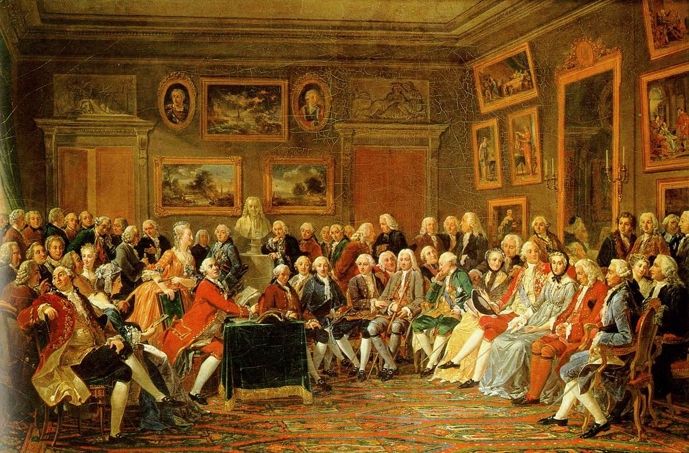
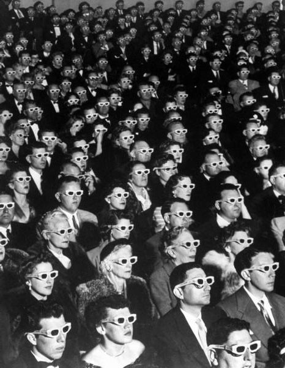
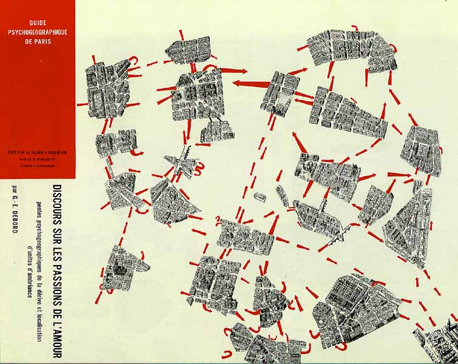

class: title, smokescreen, shelf, no-footer
background-image: url(luis-valladolid-GIdzFoCXcdM-unsplash.jpg)

# Media in Everyday Life, Part II
## November 7, 2022

---
# Media and Everyday Life

* Shift from _what do media do to people?_ to _what do people do with media?_ 

* Media mediates our everyday lives and practices

* Everyday Life:  quotidian, everyday, mundane, ordinary

---
class: roomy

# Everyday Life

* Michel de Certeau: human subject is mobile, mediated, and mediating, engages in world by negotiating spaces

    * Practices of Everyday Life

    * de Certeau's **tactics** of everyday life vs **strategies** of dominant power

* _Media practice:_ engagement with everyday social space through media

???
sociology of media practices . . . 

schools shut down access to social media and chat apps (strategy); students use Google docs as a real-time chat platform (tactic)

---
class: compact

# History of Media Criticism

Alongside media history is an history of media criticism, including:

* Horkheimer &amp; Adorno's critique of "sameness"/mass culture

* Stuart Hall's "decoding positions"

* John Fiske's readerly "culture from below"

* James Scott. "arts of resistance"

* Nestor Garcia Canclini's "hybridity"

* Habermas and the "public sphere"

* Guy Debord and the Situationists - art and everyday life

---

class: col-2, compact
# What is the Public Sphere?

 <small><caption>Anicet Charles Gabriel Lemonnier _In the Salon of Madame Geoffrin in 1755_</caption></small>

* Benedict Anderson: National-scale media help foster an "imagined community" of the nation
* "Mass media" - experience of simultaneity (commonality of experiencing events at the same time)
* "Public Sphere" - "private people gathered together as a public and articulating the needs of society with the state" (Jurgen Habermas)
* (idealized) space of democratic politics, a democratic "commons"
* Distinct from "private sphere" (domestic space)
* A _discursive_ space (Michael Warner) - where political discourse happens

???
The term was originally coined by German philosopher Jürgen Habermas who defined the public sphere as "made up of private people gathered together as a public and articulating the needs of society with the state”.

Rise of the bourgeois public sphere — gathering in coffee shops, reading newspapers and debating the issues of the day

Habermas stipulates that, due to specific historical circumstances, a new civic society emerged in the eighteenth century. Driven by a need for open commercial arenas where news and matters of common concern could be freely exchanged and discussed—accompanied by growing rates of literacy, accessibility to literature, and a new kind of critical journalism—a separate domain from ruling authorities started to evolve across Europe. "In its clash with the arcane and bureaucratic practices of the absolutist state, the emergent bourgeoisie gradually replaced a public sphere in which the ruler's power was merely represented before the people with a sphere in which state authority was publicly monitored through informed and critical discourse by the people”.[24]    Democracy replaces Sovereign Domination  

---
class: full-bleed, no-footer, center

---
class: compact
# Critiques of Public Sphere (Nancy Fraser)

* concept of unified public sphere is fallacy based on exclusion:

    * of women because of relative immobility in relation to the private sphere

    * of the poor because of the necessity of being relatively free from the vicissitudes of the economic sphere
--

* theorization of:

    * _counterpublics_: groups subordinate to dominant public but still sites from which people can speak up in society

    * _networked publics_: publics and counterpublics formed in online discussion forums

---
class: img-left-full

# _Society of the Spectacle_
## Guy Debord 1967

> This book should be read bearing in mind that it was written with the deliberate intention of doing harm to spectacular society.  

> There was never anything outrageous, however, about what it had to say.

---
class: col-2

# Context:  Guy Debord &amp; the Situationists

<iframe style="position:fixed;left:40%; top:20%; width:58%;height:60%" src="https://www.youtube-nocookie.com/embed/2SvdWk8zRrI?start=15" frameborder="0" allow="accelerometer; autoplay; encrypted-media; gyroscope; picture-in-picture" allowfullscreen></iframe>

---
# The Spectacle

* Not a collection of images, but **a social relationship between people that is mediated by images.**

--

* Both the outcome and goal of the dominant mode of production.

--

* Specific Manifestations:
    * News or Propaganda
    * Advertising
    * The Actual Consumption of Entertainment

---
# The Spectacle, Cont'd

* The spectacle is real, even though it falsifies reality

--

* Feuerbach:  “the present age...prefers the sign to the thing signified, the copy to the original, representation to reality”

--

* Proclaims the predominance of <u>appearances</u> and asserts that all human life, which is to say all social life is mere appearance.

--

* The "chief product of modern society"

--

* Being &rarr; Having &rarr; Appearing

---
class: center
# The Spectacle and the Spectator

Passive spectatorship / The Power to Consume

<iframe width="70%" height="70%" src="https://www.youtube-nocookie.com/embed/7QbV6QVfMU4?start=62&end=400" frameborder="0" allow="accelerometer; autoplay; encrypted-media; gyroscope; picture-in-picture" allowfullscreen></iframe>

---
# Leisure and the Spectacle

* “Free time” - Illusion of leisure as freedom:

> There can be no freedom apart from activity, and within the spectacle all activity is banned - a corollary of the fact that all real activity has been channeled into the global construction of the spectacle.  So what is referred to as “liberation from work,” that is, increased leisure time, is a liberation neither within labor itself nor from the world labor has brought into being. [27]

* The work of consumption, keeping up appearances (a “surplus ‘collaboration’ is required of the workers. [43]).  
 Social Media / Self as Brand?

---
# The Spectacle as:

## Negation of Life

* The replacement of _living desires_ with _pseudo-needs_

## Separation Perfected

* The separation of art from everyday life

---
class: no-footer
### Separation Perfected

---
class: center, no-footer

---
# Critique as Gathering/Assembly

> The role of avant-garde currents, wherever they may appear, is to link these people and these experiences together; to help unify such groups and the coherent basis of their project. We have to publicize, elucidate and develop these initial gestures of the next revolutionary era. They can be recognized by the fact that they concentrate in themselves new forms of struggle and a new content (whether latent or explicit): the critique of the existing world. Thus the dominant society, which prides itself so much on its constant modernization, is now going to meet its match, for it has finally produced a modernized negation.

---
# Art and Everyday Life

* The construction of "situations": "the concrete construction of momentary ambiances of life and their transformation into a superior passional quality."

* Practices that capture “Living Desires” and help us distinguish them from “Pseudo-needs”

???

Debord defined psychogeography in 1955 as "the study of the precise laws and specific effects of the geographical environment, consciously organized or not, on the emotions and behavior of individuals." Debord advocated for, "active observation of present-day urban agglomerations, "to discover how environments effected the behavior and feelings of individuals and, conversely, how to make new environments that created the possibility for "a new mode of behavior.” a reconfiguration of urban environments to allow for creativity and play.

Influenced by the 19th century French poet Charles Baudelaire's concept of the flâneur, a kind of dandy who wandered the city, dérive, or drift, was defined by Debord as, "the practice of a passional journey out of the ordinary through a rapid changing of ambiences." The concept, which was also called Situationist drift, was an essential component of psychogeography, as a place was 'mapped' by individuals wandering freely through the urban environment and finding their own ambient site

---
class: fit-h1, center
# _Psychogeographique de Paris. Speech on the Passions of Love_ (1957)

???

The first published discussion of psychogeography was in the Lettrist journal Potlatch (1954), which included a 'Psychogeographical Game of the Week':

Depending on what you are after, choose an area, a more or less populous city, a more or less lively street. Build a house. Furnish it. Make the most of its decoration and surroundings. Choose the season and the time. Gather together the right people, the best records and drinks. Lighting and conversation must, of course, be appropriate, along with the weather and your memories. If your calculations are correct, you should find the outcome satisfying. (Please inform the editors of the results.)[6]

---
class: center
# The Dérive

Artist: [Lizzy Mary Cullen](https://www.lizziemarycullen.com/)
???

Theory of the Dérive (Debord, 1956)

> One of the basic situationist practices is the dérive [literally: “drifting”], a technique of rapid passage through varied ambiances. Dérives involve playful-constructive behavior and awareness of psychogeographical effects, and are thus quite different from the classic notions of journey or stroll.
In a dérive one or more persons during a certain period drop their relations, their work and leisure activities, and all their other usual motives for movement and action, and let themselves be drawn by the attractions of the terrain and the encounters they find there. Chance is a less important factor in this activity than one might think: from a dérive point of view cities have psychogeographical contours, with constant currents, fixed points and vortexes that strongly discourage entry into or exit from certain zones.

> Our loose lifestyle and even certain amusements considered dubious that have always been enjoyed among our entourage — slipping by night into houses undergoing demolition, hitchhiking nonstop and without destination through Paris during a transportation strike in the name of adding to the confusion, wandering in subterranean catacombs forbidden to the public, etc. — are expressions of a more general sensibility which is no different from that of the dérive. Written descriptions can be no more than passwords to this great game.

> Today the different unities of atmosphere and of dwellings are not precisely marked off, but are surrounded by more or less extended and indistinct bordering regions. The most general change that dérive experience leads to proposing is the constant diminution of these border regions, up to the point of their complete suppression.

---
class: img-caption, no-footer

# "Eye Gazing" as Interpersonal Derive?

???
Discuss

---
class: center
# Radi-Aid as Detournement

https://www.radiaid.com/

???

Relation by people mediated by images -- colonial / orientalist "global health" gaze

---
# For Wednesday

Read:

* _Practices of Looking,_ Chapter 7 (pp. 257-278)