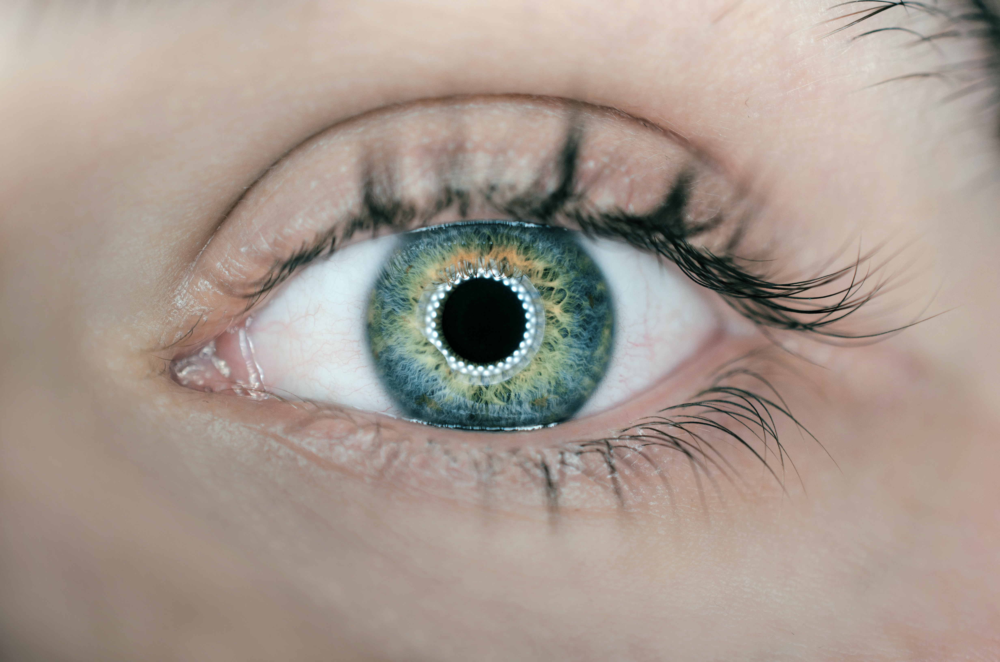

class: title, smokescreen, shelf, no-footer
background-image: url(merakist-CNbRsQj8mHQ-unsplash.jpg)

# Public Sphere or the Spectacle?
## November 9, 2022

---

class: col-2, compact
# What is the Public Sphere?

* _Public Sphere_ - "private people gathered together as a public and articulating the needs of society with the state" (Jurgen Habermas)
--

* (idealized) space of democratic politics, a democratic "commons"
--

* A _discursive_ space (Michael Warner) - where political discourse happens
--

* _counterpublics_ (Nancy Fraser): groups subordinate to dominant public but still sites from which people can speak up in society
--

* _networked publics_: publics and counterpublics formed in online discussion forums

???

idea  of the commons; social media as public sphere

---
class: full-bleed, no-footer, center

---

class: img-left-full, compact

# _Society of the Spectacle_ (Debord, 1967)

The **Spectacle**:
* Not a collection of images, but **a social relationship between people that is mediated by images.**

--

* Both the outcome and goal of the dominant mode of production.  "The chief **product** of modern society"

--

* Aspires for **totality** (complete colonization of everyday life, no outside or alternative)

---
class: compact

# The Spectacle as "Separation Perfected"

Separation from:

*  **Reality**:  “the present age...prefers the sign to the thing signified, the copy to the original, representation to reality” (Debord quotes Feuerbach)

--

* **Authentic Needs**:  The replacement of _living desires_ with _pseudo-needs_

--

* **Activity/Agency**:  "within the spectacle all activity is banned - a corollary of the fact that all real activity has been channeled into the global construction of the spectacle"

    * Rather than making history, we are mere spectators to it
    * Freedom is in the private sphere:  only power is to consume in order to "keep up appearances," only choice is to choose among commodities (even voting is a choice among commodities, not real political activity)

---
class: no-footer
### Separation Perfected

---
class: center, no-footer

---
# How make art and life inseparable?

* The construction of "situations": "the concrete construction of momentary ambiances of life and their transformation into a superior passional quality."

* Practices that capture “Living Desires” and help us distinguish them from “Pseudo-needs”

---
class: center
# The Dérive

Artist: [Lizzy Mary Cullen](https://www.lizziemarycullen.com/)
???

Theory of the Dérive (Debord, 1956)

> One of the basic situationist practices is the dérive [literally: “drifting”], a technique of rapid passage through varied ambiances. Dérives involve playful-constructive behavior and awareness of psychogeographical effects, and are thus quite different from the classic notions of journey or stroll.
In a dérive one or more persons during a certain period drop their relations, their work and leisure activities, and all their other usual motives for movement and action, and let themselves be drawn by the attractions of the terrain and the encounters they find there. Chance is a less important factor in this activity than one might think: from a dérive point of view cities have psychogeographical contours, with constant currents, fixed points and vortexes that strongly discourage entry into or exit from certain zones.

> Our loose lifestyle and even certain amusements considered dubious that have always been enjoyed among our entourage — slipping by night into houses undergoing demolition, hitchhiking nonstop and without destination through Paris during a transportation strike in the name of adding to the confusion, wandering in subterranean catacombs forbidden to the public, etc. — are expressions of a more general sensibility which is no different from that of the dérive. Written descriptions can be no more than passwords to this great game.

> Today the different unities of atmosphere and of dwellings are not precisely marked off, but are surrounded by more or less extended and indistinct bordering regions. The most general change that dérive experience leads to proposing is the constant diminution of these border regions, up to the point of their complete suppression.

---
class: center
# Radi-Aid as Detournement

https://www.radiaid.com/

???

Relation by people mediated by images -- colonial / orientalist "global health" gaze

---
class: img-caption, no-footer

# "Eye Gazing" as Interpersonal Derive?

???
Discuss

---

# Preliminary Dicussion: Last Writing Assignment (Due November 30th)

--- 

* An opportunity to engage a visual object in a more rigorous theoretical manner.

* Engage theory / theorists unmediated by _Practices of Looking_

???

Do:
* Choose a visual object because you want to learn something about it.
* 

Don't:

* Choose an visual object because you already know what there is to say about it.
* Pick a theory and then 

---
# For Friday

Bring image objects and your thoughts on stakes and theories

# For Monday

Read: (!! Note schedule change !!)

* _Practices of Looking_, Chapter 8 (pp. 301-336)