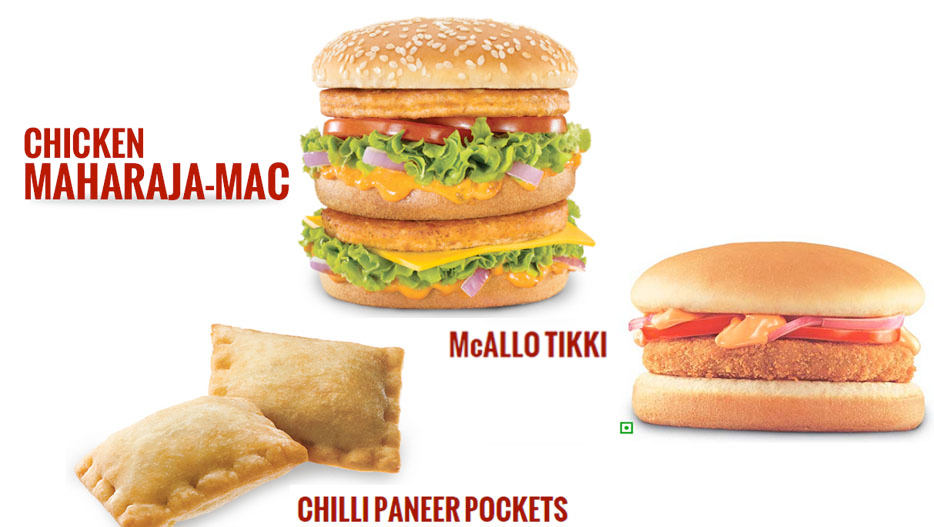
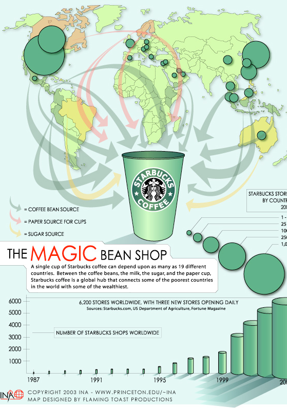
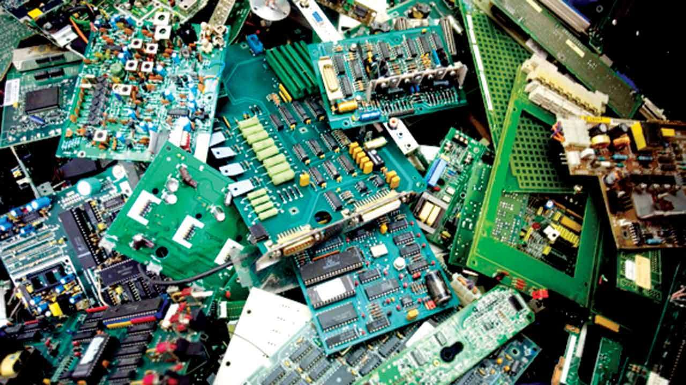
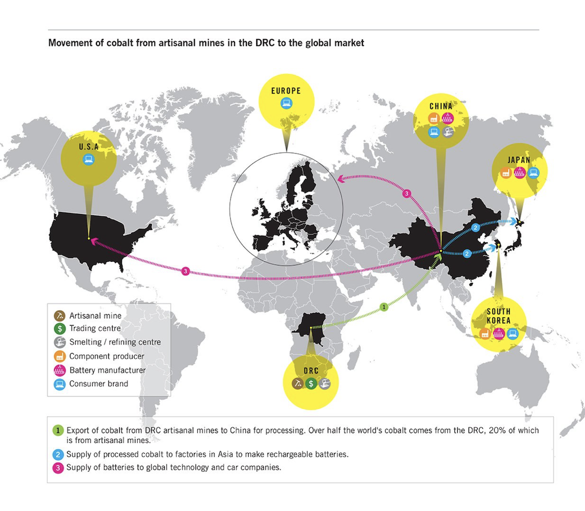
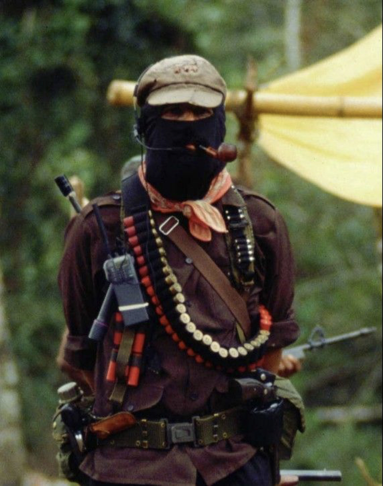
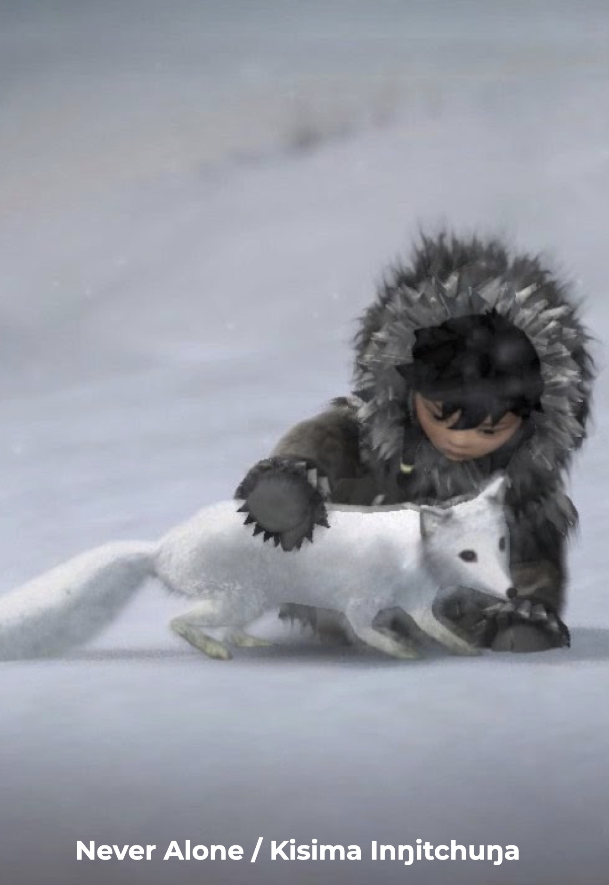

class: title, smokescreen, shelf, no-footer
background-image: url(nasa-Q1p7bh3SHj8-unsplash.jpg)

# The Global Flow of Visual Culture
## December 5, 2022

---

# Global Gaze - The World (as) Image

???
Global Gaze - See the world as a totality

apprehendable in a glance // simultaneous time

David Harvey - Time/Space Compression 

Tied to space exploration, the “god’s eye view” of satellites

---
class: img-right-full
# Satellite Transmission

Interconnected Global Village (McLuhan)

--

Remote Sensing
* Satellite Panopticon
* Total Surveillance

--

"Outside Looking In"
* Weather Satellites
* Google Earth

---
class: col-2

# _Our World_ (PBS, 1967): Crafting a “Global Now”

<video width="90%" height="70%" controls>
  <source src="our_world_clip.mov" type="video/mp4">
Your browser does not support the video tag.
</video> <small><caption>https://youtu.be/wbWMBiz2z7k</caption></small>

--

* Global “Now”

* Culturally Worldly

* Geographically Mobile

* Modernization 

* Global Unity

* Planetary Control

---

**Anthropocene Visuality** 
<small>Mirzoeff, N. (2014).  Visualizing the Anthropocene. _Public Culture, 26_ (2): 213–232.</small>

???
Against this vision of planetary control and interconnectedness:

Coined by Nick Mirzoeff to describe the effects of technologies and climate change not only on the environment but on modes of seeing:
> “The aesthetics of the Anthropocene emerged as an unintended supplement to imperial aesthetics—it comes to seem natural, right, then beautiful—and thereby anaesthetized the perception of modern industrial pollution.”

* George Wesley Bellows, Forty-Two Kids (1907) - (left) note the black water
* Claude Monet, Impression: Sun Rising, 1873 (port of Le Havre in Normandy) (top-right)
* Claude Monet, Unloading Coal, c. 1875 (London) (bottom-right) - the yellow of sulfured coal smoke

Mirzoeff proposes that Anthropocene visuality is a mode that typically obscures rather than reveals the environmental changes and social injustice caused by humankind’s impacts on the planet

---

class: img-caption

# Flow

???

P386 - Global Flow is not a new phenomenon.  Textbook maps the history, for example, of the global flow of woodblock image and moveable type reproduction techniques from Asia to Europe from the first millennium.   But they also suggest that post-WWII global flow has taken a specific valence: increased cross-border migration; global trade liberalization; emergence of multinational/transnational corporations alongside the decline of the power of national sovereignties; rise of global humanitarian efforts; formation of non-geographically bound diasporas and imagined communities.

---
class: center
# Center / Periphery

A model of globalization

---
class: center, fullbleed, no-footer

 Cultural Imperialism

???

American state-run radio and television international broadcasters financed by the federal government of the United States through the US Agency for Global Media:

* **Voice of America** founded in 1942, creates content in 47 languages which it distributes globally.  Budget: 252 million

* **Radio Televisión Martí**, founded in 1985, based in Miami, Florida,  which transmits news in Spanish to Cuba.  Budget 

* **Middle East Broadcasting Networks**, founded in 2002.   Budget: 112 million

---
class: img-left-full

# McWorld

> “I don’t believe in saturation. We’re thinking and talking worldwide.”

> &mdash; Ray Kroc, Founder of McDonald's

As of 2021, McDonald's "global footprint" extends to 38,000 restaurants in over 115 countries (13,348 in the United States)

???
Company's current revenue reports for 2022:  22.93 Billion

No longer in Russia as of May 2022

The idea of the "McDonaldization" of the world

---
class: center
# Center / Periphery???

???

What is the problem with this model?  
Assumes a one way flow, and a singular center...

---
class: center
# Center / Periphery???

???

...when in fact culture flows both ways

---
class: center
# Multiple Centers / Multiple Peripheries

???

Examples from Cinema:
* HongKong Cinema
* Bollywood (Bombay / Mumbai)
* Nollywood (Nigeria)

---
class: center
# Network - Node Model

???

Multiple centers / multiple relations and directions of cultural flow

How does the Hall's encoding/decoding model help us understand global cultural flows?  
Dominant / Resistant / Counter readings

---
class: col-2

# Glocalization
   
Hybridity

Creolization

Syncretism

---
# Glocal Apple

<iframe width="80%" height="80%" src="https://www.youtube-nocookie.com/embed/MoE9XxXUatA" frameborder="0" allow="accelerometer; autoplay; encrypted-media; gyroscope; picture-in-picture" allowfullscreen></iframe>

---
class: img-full

???

Glocalization as Capitalist Strategy

---

class: img-right

# Franchise Culture / Format Programming

Reality Television
* Big Brother
* The Bachelor
* ...Got Talent

Museums
* Louvre
* Guggenheim

---

.absolute.w-6-12th.pa-3.l-0.t-0[ **Big Brother** (Dutch Franchise) ]

???

Dutch Franchise
As of August 2021, franchised in over 62 countries

---
class: bg-black, color-white, no-footer, compact, col-3
# Got Talent

* <small>Arabs Got Talent</small>
* <small>Asia's Got Talent</small>
* <small>Australia's Got Talent</small>
* <small>Belgium's Got Talent</small>
* <small>Balgariya tarsi talant</small>
* <small>Canada's Got Talent</small>
* <small>Talento Chileno</small>
* <small>Diǎnzàn! Dárén Xiù (China)</small>
* <small>Supertalent (Bosnia/Croatia)</small>
* <small>Česko Slovensko má talent</small>
* <small>Dominicana's Got Talent</small>
* <small>East Africa's Got Talent</small>
* <small>Talent Suomi (Finland)</small>
* <small>La France a un incroyable talent</small>
* <small>Nichieri (Georgia)</small>
* <small>Das Supertalent</small>
* <small>Ellada Eheis Talento (Greece)</small>
* <small>India's Got Talent</small>
* <small>Persia's Got Talent (Iran)</small>
* <small>Got Talent ישראל (Israel)</small>
* <small>Italia's Got Talent</small>
* <small>Lietuvos talentai</small>
* <small>Malta's Got Talent</small>
* <small>Авьяаслаг Монголчууд (Mongolia)</small>
* <small>Myanmar's Got Talent</small>
* <small>Holland's Got Talent</small>
* <small>Norske Talenter</small>
* <small>Pilipinas Got Talent</small>
* <small>Mam talent! (Poland)</small>
* <small>Got Talent Portugal</small>
* <small>Românii au talent</small>
* <small>Я почти знаменит (Russia)</small>
* <small>Slovenija ima talent</small>
* <small>Got Talent España</small>
* <small>Talang (Sweden)</small>
* <small>Thailand's Got Talent</small>
* <small>Yetenek Sizsiniz Türkiye</small>
* <small>UAE Got Talent</small>
* <small>Britain's Got Talent</small>
* <small>Ukrayina maye talant</small>
* <small>America's Got Talent</small>
* <small>Got Talent Uruguay</small>

---
class: img-left-full

# Global Supply Chains

Logistics

Geomedia / Ecomedia

---
class: img-caption

**Governed Flows** | Post-9/11 / Post-COVID Securitization

---
class: col-2, roomy, fit-h1

# 'Scapes:  Describing Global Cultural Flows

_Why "-scapes"?_
* Perspectival
* Imagined Worlds

    

_Dimensions:_
  * ethnoscapes
  * mediascapes
  * technoscapes
  * financescapes
  * ideoscapes

.absolute.w-10-12th.l-1-12th.b-0[ <small>_Appadurai - “Disjuncture & Difference in the Global Cultural Economy”_</small> ]

---
class: roomy
# Ethnoscapes

* Landscape of persons

* Tourists, immigrants, refugees, exiles, guest workers

* Mobility versus emplacement

* Diaspora

---
class: roomy
# Technoscapes

* Fluid, global configuration of technology

* Technology - mechanical & informational - moves at high speeds across previously impervious boundaries

* _Differential_ distribution of technologies

---
class: roomy
# Financescapes

* Globally interconnected markets

* Massive amounts of “megamonies”

* Nation-state no longer the top of the food chain

* Speculative markets and derivatives

---
class: roomy
# Mediascapes

* The distribution of the electronic capabilities to produce and distribute information

* The images of the world created by media, which provide repertoires of images, narratives, and ethnoscapes to viewers

* Scripts formed of imagined lives

---
class: roomy
# Ideoscapes

* Political landscapes

* Ideologies of states

* Counter-ideologies of movements explicitly oriented toward capturing state power

* _Ideograms:_  freedom, welfare, rights, sovereignty, representation and democracy

---
class: roomy, no-footer
# Globalization &amp; Subjectivity

* Cosmopolitan

* Tourist

* Immigrant

* Refugee

* Exile

--

--

--

---
# Duke's Global Imaginary
## "Rooted in our region and connected to the world."

???

> Globalization creates a visual narrative that can ‘condense’ spatial-symbolic scales of the ‘local-national’ and the ‘global’ in one single place. These symbols of the ‘global’, however, may not be entirely unproblematic in their representations of the cultural identity of place, but they remain essential tools to access the global imaginary. As much as globalization is an economic and cultural force, it is also a visual-ideological phenomenon.

---
class: img-right, center
# Global Cobalt

   
Commodity Fetish: 
Mapping Global Supply Chains

https://open.sourcemap.com/

---
class: img-left-full

The “Electronic Fabric of Struggle”: Social Movements and 
Networked Publics / Politics

* Subcomandante Marcos and the Zapatista Army of National Liberation

* Arab Spring

* 2022 Iranian Protests

* 2022 COVID policy protests in China

???

subcomandante marcos — the politics of style, Chiapas Mexico indigenous political movement
Leveraging the internet

---

class: center
# The Politics of the (In)Visible

the “distribution of the sensible”

<caption><small>Sturken &amp; Cartwright, p. 403</small></caption>

---
class: img-caption

“Un violador en tu camino” https://youtu.be/yJGE9zqgna8

???

“A rapist on your way” - a networked protest that has spanned Bogotá, Santiago, Barcelona, Madrid, Berlin, New York, London and Paris.

The call was published on November 27, 2019, after its 25N intervention was viralized through social networks within the framework of the International Day for the Elimination of Violence against Women. In each country, the lyrics were adapted or some stanzas were added according to the contexts that women live.

---
class: img-left-full
# Indigeneity

--
Land "Recognition"
> “We acknowledge that we stand, live and work on the ancestral homeland of the Coharie, Eastern Band of Cherokee Indians, Haliwa-Saponi, Lumbee, Meherrin, Occaneechi Band of the Saponi, Sappony, and Waccamaw Siouan peoples whose lands include what is known today as North Carolina. We recognize those peoples as well as the many Indigenous people who live and work in the region today.”

???

Decoloniality is not a metaphor?  Tuck &amp; Yang

---
class: compact
# Epistemologies of the Global South
Transborder CyberMestiza <caption><small>Guillermo Gómez-Peña and La Pocha Nostra</small></caption>

<iframe width="60%" height="60%" src="https://www.youtube-nocookie.com/embed/IwcBE6j5458" frameborder="0" allow="accelerometer; autoplay; encrypted-media; gyroscope; picture-in-picture" allowfullscreen></iframe>  

---

class: color-white
background-image: url(indigenous_climate_change.jpg)

# Social Movements, Indigeneity, Counterpolitics

???

So we started the term with the power of images, and the dynamics of meaning production, and end with social movements, indigeneity, counterpolitics in the context of globalization . . . climate change, pandemic, etc
---

class: img-right-full

# Reflection / Refraction

What paths have we traveled?  
How far have we come?  
Where are we headed?  
What did we not see along the way?   
Who did we leave behind?

---
# For Wednesday

* Review course notes, readings, and textbook

* Complete Quiz #9 before 11:59 PM Wednesday
